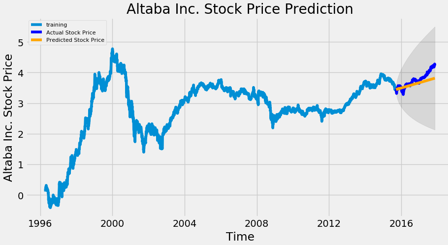
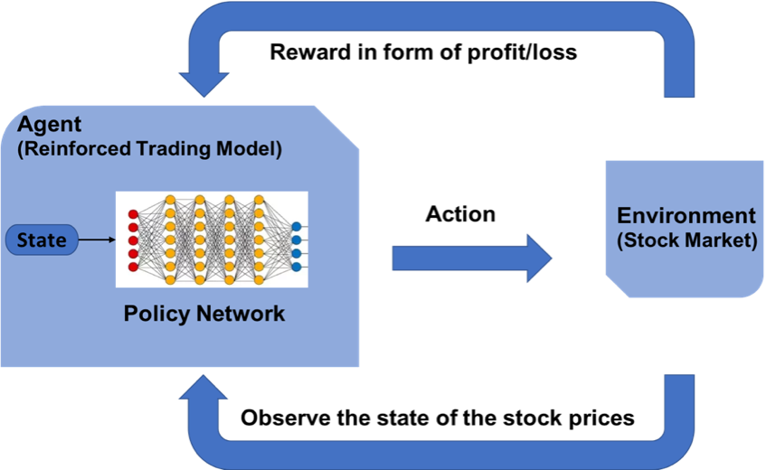
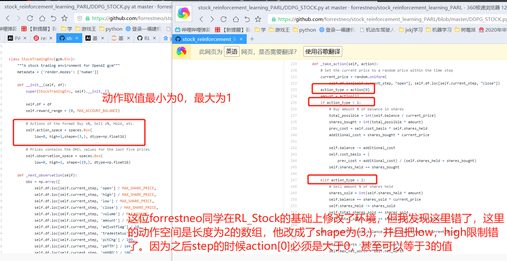
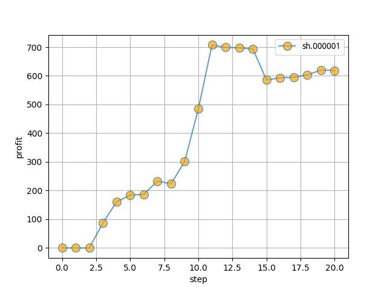

 ### 前言
 - 本项目包含了来自4个不同的股票环境的复现。其中stock1-3由于修改难度稍大，暂未实现，其下的src.txt是股票环境的原地址
- 本项目stock4数据来源和股票环境来源
https://github.com/wangshub/RL-Stock
- `RL-Stock`环境数据存在问题，会引起报错，该项目已经修改并且充分适配PARL。
- 本项目stock4在原环境的基础上，对reward奖励做了修改，原reward只要收益为正就是1，我在此基础上增加了根据收益的比例变化。

### 代码环境
```
pip install paddlepaddle==1.6.3 parl==1.3.1 gym
```
- PARL
  PARL 是百度开发的一个高性能、灵活的强化学习框架。其提供了高质量的主流强化学习算法实现，最高可支持上万个 CPU 的同时并发计算，并且支持多 GPU 强化学习模型的训练，可复用性强，具有良好扩展性。

github：https://gitee.com/PaddlePaddle/PARL
文档：https://parl.readthedocs.io/en/latest/

### 算法使用强化学习的DDPG
#### 📖 监督学习与强化学习的区别

监督学习（如 LSTM）可以根据各种历史数据来预测未来的股票的价格，判断股票是涨还是跌，帮助人做决策。



而强化学习是机器学习的另一个分支，在决策的时候采取合适的行动 (Action) 使最后的奖励最大化。与监督学习预测未来的数值不同，强化学习根据输入的状态（如当日开盘价、收盘价等），输出系列动作（例如：买进、持有、卖出），使得最后的收益最大化，实现自动交易。



DDPG简介：
- DDPG的提出动机其实是为了让DQN可以扩展到连续的动作空间。
- DDPG借鉴了DQN的两个技巧：经验回放 和 固定Q网络。
- DDPG使用策略网络直接输出确定性动作。
- DDPG使用了Actor-Critic的架构。
因为本项目采用的股票环境的动作是连续的动作空间，所以选用了DDPG算法

### 项目结构
stock4
- env.py
    - 股票环境
- model.py
- agent.py
- train.py
    - 训练代码
- evaluate.py
    - 综合股票交易评估，输出见本项目文件夹下的png文件

### RL-Stock的环境介绍
#### 观测 Observation

策略网络观测的就是一只股票的各项参数，比如开盘价、收盘价、成交数量等。部分数值会是一个很大的数值，比如成交金额或者成交量，有可能百万、千万乃至更大，为了训练时网络收敛，观测的状态数据输入时，必须要进行归一化，变换到 `[-1, 1]` 的区间内。

|参数名称|参数描述|说明|
|---|---|---|
|date|交易所行情日期|格式：YYYY-MM-DD|
|code|证券代码|格式：sh.600000。sh：上海，sz：深圳|
|open|今开盘价格|精度：小数点后4位；单位：人民币元|
|high|最高价|精度：小数点后4位；单位：人民币元|
|low|最低价|精度：小数点后4位；单位：人民币元|
|close|今收盘价|精度：小数点后4位；单位：人民币元|
|preclose|昨日收盘价|精度：小数点后4位；单位：人民币元|
|volume|成交数量|单位：股|
|amount|成交金额|精度：小数点后4位；单位：人民币元|
|adjustflag|复权状态|不复权、前复权、后复权|
|turn|换手率|精度：小数点后6位；单位：%|
|tradestatus|交易状态|1：正常交易 0：停牌|
|pctChg|涨跌幅（百分比）|精度：小数点后6位|
|peTTM|滚动市盈率|精度：小数点后6位|
|psTTM|滚动市销率|精度：小数点后6位|
|pcfNcfTTM|滚动市现率|精度：小数点后6位|
|pbMRQ|市净率|精度：小数点后6位|

### 动作 Action

假设交易共有**买入**、**卖出**和**保持** 3 种操作，定义动作(`action`)为长度为 2 的数组

- `action[0]` 为操作类型；
- `action[1]` 表示买入或卖出百分比；

| 动作类型 `action[0]` | 说明 |
|---|---|
| 1 | 买入 `action[1]的比例`|
| 2 | 卖出 `action[1]的比例`|
| 3 | 保持 |

### bug查查
1.Rl_Stock的数据

可能是api接口过于久远，获取到的数据中存在缺失项，并且是执行训练中的obs，通过观察数据发现缺失的数据有的没有缺失的股票也是0
因此在处理obs的函数中做了处理
```python
# 有些股票数据缺失一些数据，这里处理一下，不处理报错
d10 = self.df.loc[self.current_step, 'peTTM'] / 1e4
d11 = self.df.loc[self.current_step, 'pbMRQ'] / 100
d12 = self.df.loc[self.current_step, 'psTTM'] / 100
if np.isnan(d10):       # 某些股票大多是0.00000000e+00，如果是nan会报错
    d10 = d11 = d12 = 0.00000000e+00
```
2.来自forrestne

https://github.com/forrestneo/stock_reinforcement_learning_PARL/blob/master/DDPG_STOCK.py

我发现这位forrestne也使用了改环境，并且修改了环境。但是其修改有错误，导致训练出来的无法使用的：



### 优化策略（逐渐更新）
1.优化reward的赋予算法(2020.06.27)
由原来的正收益给1，负收益-100
优化为按收益比例给值，收益比例越大，reward越多


### 效果
本金10000
- 训练状况（已知股票行情变化，近29年时间）

对000001号股票进行训练至少可以达到650%的收益(效果持续更新)

Test reward: 191544.98690586974，Profit: 66390.91080466074（非最终效果）
Test reward: 191689.68749662943  Profit: 66590.82648899195
- 评估效果（22天）

收益6.18%：
Profit: 618.8684061821114 （非最终效果）



 
